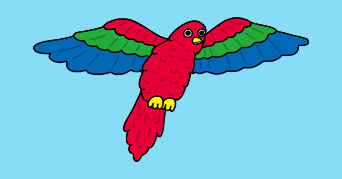

# flappy-parrot

Create a game in which you have to guide a parrot through scrolling pipes to score points.

Find the project online at [projects.raspberrypi.org/en/projects/flappy-parrot-scratch2](https://projects.raspberrypi.org/en/projects/flappy-parrot-scratch2)

## Resources
For resources and project materials, see [en/resources](https://github.com/raspberrypilearning/flappy-parrot-scratch2/tree/master/en/resources)

## Contributing
See [CONTRIBUTING.md](CONTRIBUTING.md)

## Licence
 See [LICENSE.md](LICENSE.md)
