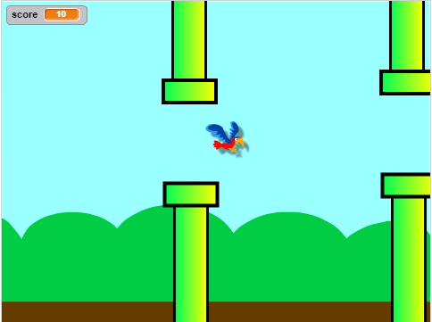

--- no-print ---

This is the **Scratch 2** version of the project. There is also a [Scratch 3 version of the project](https://projects.raspberrypi.org/en/projects/flappy-parrot).

--- /no-print ---

## Introduction

Create a game in which you have to guide a parrot past scrolling pipes to score points.

### What you will make

Click the green flag to start the game. Press the <kbd>space</kbd> bar to make the parrot flap its wings, and try to get it to fly through the gaps in the pipes! You score one point for every pipe that you manage to get the parrot past.

--- no-print ---

  <iframe allowtransparency="true" width="485" height="402" src="https://scratch.mit.edu/projects/embed/258349724/?autostart=false" frameborder="0" scrolling="no"></iframe>
  

--- /no-print ---

--- print-only ---
You will press the <kbd>space</kbd> bar to make the parrot flap its wings, and score one point for every pipe that you manage to get the parrot past.

--- /print-only ---

--- collapse ---

---
title: What you will need
---

### Hardware

+ A computer capable of running Scratch 2.0

### Software

+ Scratch 2.0 [offline](https://rpf.io/scratchoff)

--- /collapse ---

--- collapse ---

---
title: What you will learn
---

+ How to create sprites using Vector mode
+ How to use sounds  
+ How to detect collisions
+ How to control a sprite using the keyboard 

--- /collapse ---

--- collapse ---

---
title: Additional notes for educators
---

--- no-print ---

If you need to print this project, please use the [printer-friendly version](https://projects.raspberrypi.org/en/projects/flappy-parrot-scratch2/print){:target="_blank"}.

--- /no-print ---

You can [find the solution to this project here](https://rpf.io/p/en/flappy-parrot-scratch2-get).

--- /collapse ---
