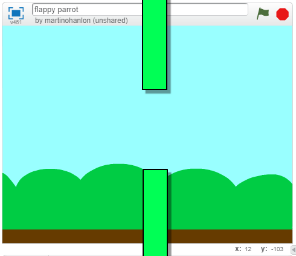
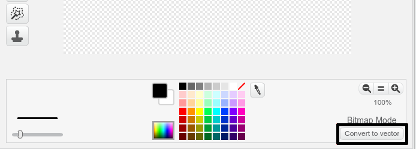
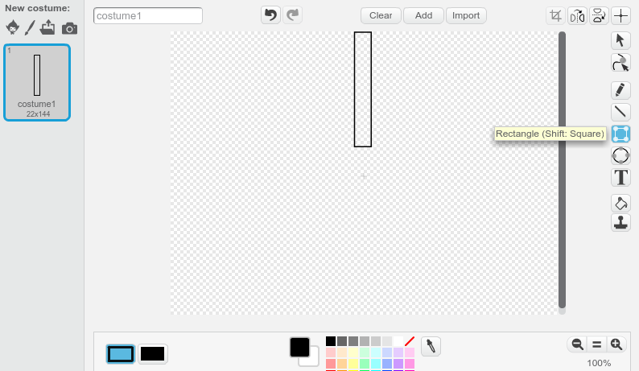
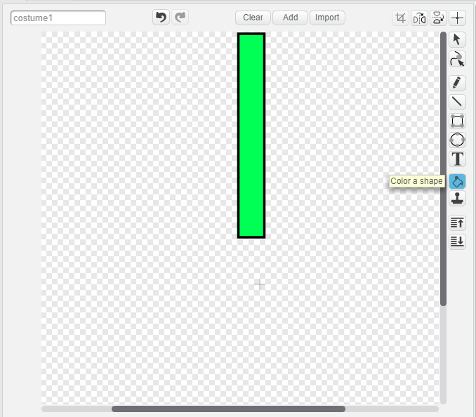
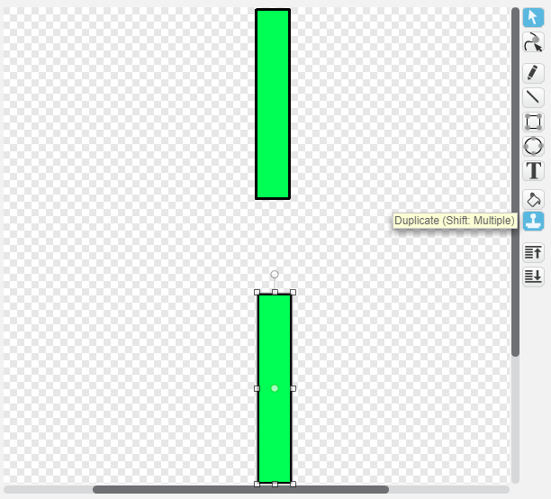

## Add the pipes

First, create the pipes.

--- task ---

Open a new empty Scratch project.

[[[generic-scratch-new-project]]]

--- /task ---

--- task ---

Add a background with an outdoor landscape. 'blue sky' is a good choice.


[[[generic-scratch-backdrop-from-library]]]

--- /task ---

--- task ---

Click on the **Paint new sprite** button and name your sprite 'Pipes'.

[[[generic-scratch-rename-sprite]]]

--- /task ---

The 'Pipes' sprite should be a pair of pipes with a gap in the middle. By moving the sprite up or down, you can put the gap in a different place.

This picture shows an example of how the pipes could be positioned. The parts of the sprite outside the Stage are normally hidden, you only see then when you drag the sprite:



You can't draw a sprite as big as the pipes need to be, but you can increase the size at which the sprite shows on the Stage.

--- task ---


Add code to make the sprite bigger.
```blocks
when green flag clicked
set size to (200) %
```

This makes it's easier to see how big the pipes should be.

--- /task ---

--- task ---

Switch the Paint editor to Vector mode by clicking on **Convert to vector** in the bottom right-hand corner.



--- /task ---

--- task ---

Draw a black outline rectangle for the top pipe as shown here:



--- /task ---

--- task ---

Fill the rectangle with a colour you like.



--- /task ---

--- task ---

Click on the **duplicate** (stamper) tool and then on your pipe to create a copy of the pipe.

Drag the copy of the pipe to the bottom of the screen so that the copy is in line with the other pipe and there's a gap between the two pipes.



--- /task ---
