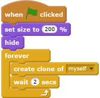
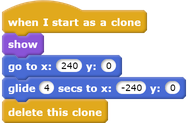
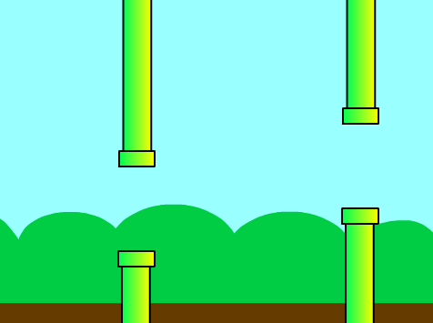
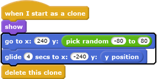

## Make the pipes move

Next you're going to make the pipes move across the screen to create an obstacle course.

--- task ---

First make the pipes appear by adding code to the Pipes sprite so that, `when the green flag is clicked`{:class="blockevents"}, the sprite `forever`{:class="blockcontrol"} `creates a clone of itself`{:class="blockcontrol"} every two seconds. 

**Tip:** clones are just copies of a sprite, and they are really useful for creating games. 

--- /task ---

--- task ---

Next make the pipes move by adding code so that, `when a clone starts`{:class="blockcontrol"}, the clone appears on the right side of the Stage and `glides`{:class="blockmotion"} across to the left.

**Tip:** you can stop the pipes scrolling by clicking the red **stop** button next to the green flag.

--- /task ---

Now you should have lots of pipes, but their gaps are always in the same place. 

You can add some variety by using a `random`{:class="blockoperators"} number for the Pipes sprite's `y position`{:class="blockmotion"}.

--- task ---

Modify your sprite's code so that each sprite clone `picks a random number from -80 to 80`{:class="blockoperators"} and `glides`{:class="blockmotion"} to that `y position`{:class="blockmotion"}:

--- /task ---

