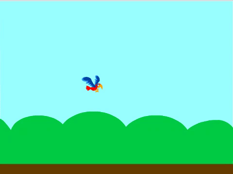
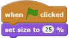
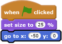
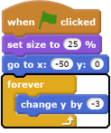

## Make Flappy fall

Now add a sprite called Flappy and create code it so Flappy falls down the Stage. In the next step, you will add the code to make Flappy fly when you press a key.

--- no-print ---

--- /no-print ---

--- task ---

Add a new sprite that has two costumes, for 'wings up' and 'wings down', and name it `Flappy`.

The parrot sprite is a good choice.

--- /task ---

Flappy needs to be smaller.

--- task ---

Add code to `set Flappy's size to 25%`{:class="blocklooks"} `when the green flag is clicked`{:class="blockevents"}.

**Tip:** you could also use the **Shrink** tool to make your sprite smaller.

--- /task ---

When the game starts, Flappy needs to be just left of the centre of the Stage, at coordinates `-50, 0`. 

--- task ---

Add code to make Flappy `go to the x and y`{:class="blockmotion"} starting position of `x: -50`{:class="blockmotion"} and `y: 0`{:class="blockmotion"}.

[[[generic-scratch-set-coordinates]]]

--- /task ---

--- task ---

Now make Flappy keep falling down the Stage by `forever`{:class="blockcontrol"} `changing the sprite's y position by -3`{:class="blockmotion"}.

--- /task ---

--- task ---

Test your code to make sure Flappy starts in the middle of the screen and falls to the bottom. When you drag Flappy to the top of the Stage, the sprite should fall again.

--- /task ---
