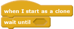
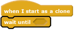
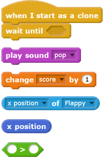
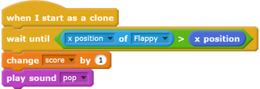

## Add a score

The player should score a point every time Flappy makes it through a gap between pipes.

--- task ---

Make a new variable **for all sprites** and call it `score`{:class="blockdata"}.

[[[generic-scratch-add-variable]]]

--- /task ---

Each 'Pipes' sprite clone should `wait until`{:class="blockcontrol"} Flappy has flown past and then increase the `score`{:class="blockdata"}.

--- task ---

First, `set score to 0`{:class="blockdata"} when the game begins:

--- /task ---

--- task ---

Then add the following code to the `Pipes` sprite:

--- /task ---

--- task ---

Add more code so that, when Flappy's `x` position is greater than the pipe clone's `x` position, the `score`{:class="blockdata"} increases by `1` and a sound of your choice plays.

You could use the 'pop' sound if you want, or add a sound from the library, for example 'bird'.

--- hints ---

--- hint ---

You need to `wait until`{:class="blockcontrol"} `Flappy's x position`{:class="blocksensing"} is `greater than (>)`{:class="blockoperators"} the `x position`{:class="blockmotion"} of `Pipes`.  

Then `change score by 1`{:class="blockdata"} and `play a sound`{:class="blocksound"}. 

--- /hint ---

--- hint ---

Use these blocks in the correct order:

--- /hint ---

--- hint ---

Your code should look like this:

--- /hint ---

--- /hints ---

--- /task ---

--- task ---

Test your code and make sure you score a point every time Flappy gets through a gap between pipes. Check whether the `score`{:class="blockdata"} is set to `0` when you start a new game.

--- /task ---
